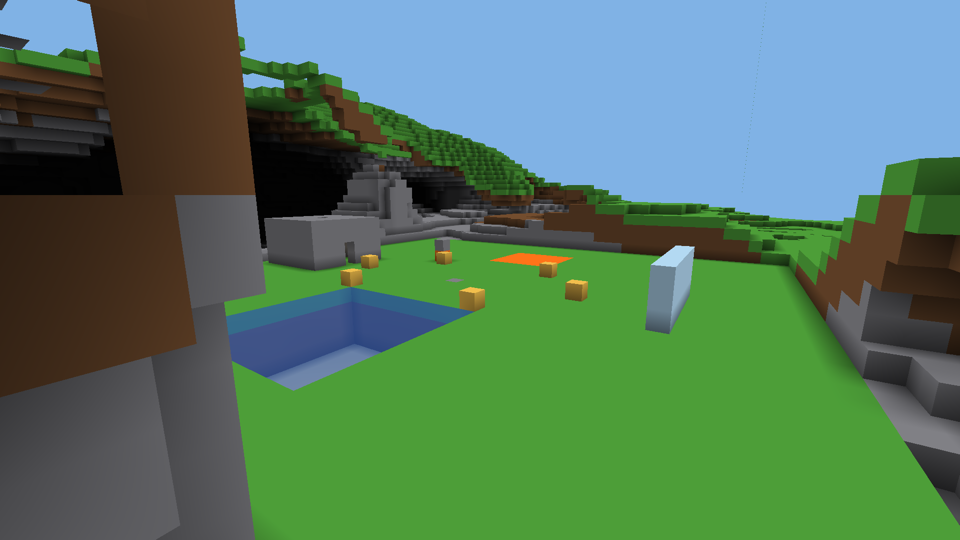
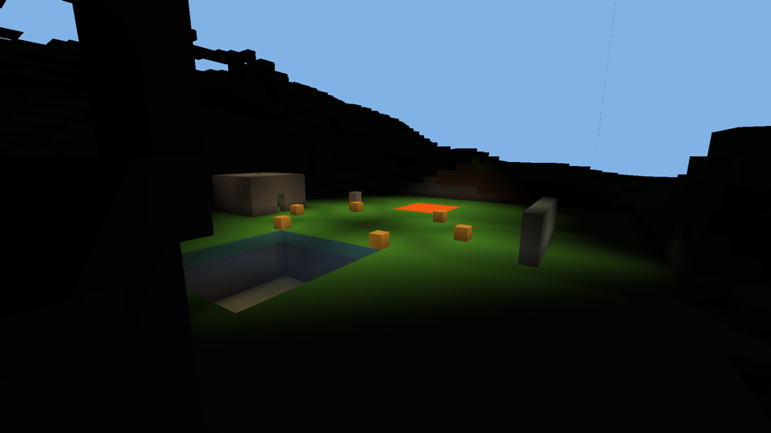

# Spike: lighting for the Metal voxel renderer

A standalone Rust crate (not a member of the repo workspace) built on the
terrain-meshing spike (`spikes/metal-meshing`). It answers how the renderer
in `docs/metal-design.md` should light the world: where the game's block
light and sky light get computed, what they are stored in, how a face is
shaded from them, and what sun shadows, dynamic lights and being underwater
cost on the GPU.

The short version. **Light lives in a 3D light volume the GPU computes and
samples, not in the faces.** A compute kernel runs the game's flood fill a
section at a time, in rounds driven by GPU-appended lists, and writes each
section into an 18³ brick (the section plus a one-texel border) of a 3D
texture. The fragment shader reads that texture and applies the game's
smooth-lighting rule per pixel. Every light value is bit-exact against a CPU
reference of the game's rule, from scratch and through edits. The whole test
world lights in 3.3 ms; a torch placed or removed costs 0.15 to 0.6 ms of
GPU time and remeshes nothing; lighting adds 0.13 to 0.18 ms to a 1080p
frame. Ambient occlusion is the one thing that goes into the face: 8 bits,
which fit the reserved bits the meshing spike left.




Machine: Apple M1 Max (10-core CPU, 32-core GPU, 64 GB), macOS 26.3, Rust
1.97.1, objc2 0.6.4, objc2-foundation 0.3.2, objc2-metal 0.3.2.

## How to run

```sh
cd spikes/lighting
cargo test --release                  # 9 tests; the Metal ones need a GPU
MTL_DEBUG_LAYER=1 MTL_DEBUG_LAYER_ERROR_MODE=assert cargo test --release
MTL_DEBUG_LAYER=1 MTL_DEBUG_LAYER_ERROR_MODE=assert MTL_SHADER_VALIDATION=1 cargo test --release
cargo run --release                   # every measurement below (about 40 s)
SPIKE_IMAGES=$PWD/images cargo run --release   # also writes the PNGs (1080p, uncompressed)
cargo clippy --all-targets -- -D warnings
```

## What is in it

| File | What |
|---|---|
| `shaders/common.metal` | Shared structs and constants, the section directory lookup (any of the 26 neighbours), brick addressing. |
| `shaders/mesh.metal` | The meshing spike's mesher with the full 26-neighbourhood in the tile and ambient occlusion per corner packed into the face. |
| `shaders/light.metal` | `light_clear` and `light_relax`: the flood fill, one threadgroup per dirty section, rounds through GPU lists, the brick write. |
| `shaders/shade.metal` | The shading rule shared by the draw shaders and the test probe: a face corner's light from the atlas, and the ray march through the volume. |
| `shaders/cull.metal` | Frustum and direction culling into the chunk list (the meshing spike's recommended path). |
| `shaders/draw.metal` | The vertex-pulling draw with three shading modes, the lightmap, sun shadow rays, dynamic lights, water fog, and the water pass. |
| `shaders/probe.metal` | Test kernel: the shading rule's four corner values for every face of a section. |
| `src/cpu_light.rs` | The CPU reference: the game's block and sky light flood fill, and its per-vertex smooth lighting and occlusion rule. |
| `src/light.rs` | The GPU light engine: volume, atlas, lists, rounds, timing. |
| `src/scene.rs` | A world kept in step on the GPU through edits, and the dirty sets an edit needs. |
| `src/world.rs` | Blocks, cull classes, opacity and emission per block, the lit test world. |
| `src/render.rs` | Cull, the opaque and water draws, the lightmap texture. |
| `tests/lighting.rs` | The tests. |
| `src/main.rs` | The benchmark and the images. |
| `images/` | The committed pictures, shrunk to 960 wide with `sips` (the writer in `src/png.rs` stores uncompressed). |

## The game's rule, as built here

Two channels, 0 to 15 each, one byte per block: `sky << 4 | block`.

- **Block light.** A block emits its level (torch 14; glowstone, lava, sea
  lantern 15). Light entering a block loses `max(1, opacity)`: air, glass and
  a torch have opacity 0, leaves and water 1, full blocks 15. A cell's level
  is the max of its emission and what arrives from its six neighbours.
- **Sky light.** The same fill with the sky above the world as the source at
  15, plus the one special case: 15 coming straight down into a block of
  opacity 0 stays 15. So a column of air under open sky is 15 all the way
  down, water takes one level per block of depth, and light spreads under an
  overhang losing one per block.
- **Smooth lighting.** A face corner's light is the average (floored) of the
  four blocks on the face's outside touching that corner. A block with no
  light at all takes the face-adjacent block's value instead, so a wall's
  dark inside never darkens the face it bounds. When both side blocks are
  full, the diagonal is out of sight and one side stands in for it.
- **Ambient occlusion.** Per corner, the count of full blocks among those
  same side and diagonal blocks (0 to 3), with the same diagonal rule;
  brightness is `1 - 0.2 * count`.
- **The lightmap.** `(sky, block)` becomes a colour through a 16 × 16 texture
  sampled bilinearly, as the game does; sky is scaled by the time of day and
  tinted toward moonlight at night, block light is warm. The spike's curve is
  an approximation of the game's; the mechanism is the game's.

This is written from memory of the wiki and the deobfuscated source, not
copied. The CPU reference (`src/cpu_light.rs`) is the spike's definition of
the rule; the GPU is tested against it, not against the game.

## The design

### The light volume and the atlas

Two copies of the light, both on the GPU:

- **The volume**: one byte per block, section-major like the blocks, 4 KB per
  section. The propagation kernel reads and writes it. It is the state.
- **The atlas**: a 3D `R16Uint` texture of 18³ **bricks**, one per section,
  each the section's 16³ plus a one-texel border copied from its 26
  neighbours. A texel is the light byte plus the block's opacity in bits
  8–11. The shaders read it. It is a derived copy, rewritten whenever a
  section's light is recomputed.

Why bricks with a border, not one big 3D texture: at render distance 32 a
monolithic texture of 1024 × 384 × 1024 blocks is 800 MB at 2 bytes a texel,
and it could not be sparse. Bricks go where the sections are, through the
same directory (`SectionInfo.brick`), and only sections with faces need
one. The border is exactly what the shading rule reads: a corner of a face
on a section's edge averages blocks in the next section, and with the border
every read a face makes stays inside its own brick. Nothing in the shader
ever asks which section a neighbouring block is in.

Why `R16Uint` and integer reads, not a filtered `RG8Unorm`: the game's rule
needs the four blocks separately (the zero-substitution and the diagonal
rule), which a hardware trilinear sample cannot do. A filtered sample of a
"dilated" texture (opaque texels given their neighbours' light) was
considered and rejected without building: it leaks light through
one-block walls, the very artefact the game's substitution rule exists to
prevent. Integer reads are also what let the tests be exact.

Why the opacity is in the texel: the shading rule's occlusion needs it, and
so does a shadow ray. A block change rewrites the brick anyway.

### Propagation on the GPU

`light_relax`, one threadgroup (256 threads) per section in a list:

1. Load the section's light and a one-block border into an 18³ tile in
   threadgroup memory, and the opacity of every cell. Neighbours, diagonal
   ones included, are found through the **section directory** (a grid of
   section slots, `NONE` where nothing is loaded), which `SectionInfo`'s six
   neighbour links from the meshing spike could not do.
2. Raise every interior cell's block light to its emission.
3. Sweep every column top to bottom, raising each cell to what its six
   neighbours allow, until a sweep changes nothing. Values only ever rise, so
   threads racing on the tile cannot go wrong: the fixed point is the same in
   any order. Sky light falls a whole column in one sweep.
4. Write the interior back to the volume and the whole tile to the brick.
5. If any cell on one of the six boundary layers changed, queue the
   neighbours on that side for the next round: face neighbours because their
   light depends on it, edge and corner neighbours because their brick
   borders hold it. A flag per section per list keeps each section in a list
   once. The list's count is the next round's indirect dispatch.

**Decreases.** A flood fill that only rises cannot remove light. The game's
engine has a second "unlight" pass for that. Here a decrease is a **reset**:
before the rounds, `light_clear` zeroes the sections whose light could have
gone down, and the rounds rebuild them from their sources and their borders.
Which sections those are is small and known (`scene.rs`, `dirty_for`):

| Edit | Can lower | Reset |
|---|---|---|
| Emission rises, or opacity falls (place a torch, dig) | nothing | none: relax the section, light spreads |
| Emission falls (remove a torch) | block light within 15 blocks | the 27 sections around |
| Opacity rises (place a block) | block light within 15; sky light anywhere below in the column | the 3 × 3 columns of sections from one above the block to the bottom |

The sky case is the conservative one, because 15 falls without loss: a block
placed on the surface can darken a shaft to bedrock. A sharper bound would
reset below only where the column's direct-sky status actually changed.

**Rounds.** A round is a fill of the next list's count and one indirect
dispatch. The CPU encodes a fixed number of rounds per frame and never reads
back a count; an empty round costs 0.037 ms. An update that needs more rounds
than a frame encodes simply continues next frame, which is what the game's
engine does too. The tests instead run a round at a time and stop when a
round has nothing to do, so they know how many rounds each edit took.

**Two races found and fixed, both by the exact tests.** A section clears its
"queued" flag at the start of its run; the first version did that on one
thread while the others were already reading neighbours, so a neighbour that
changed its border in between saw the flag still up and did not queue the
section again. A barrier after the clear cut the failures but did not end
them, because a section queued in the *current* round also shows the flag
up. The fix that held is a flag set per list, ping-ponged like the lists: a
changed border always queues the neighbour for the next round, whether or
not it is running now, so correctness rests only on the order of dispatches,
never on what one threadgroup sees of another's writes mid-dispatch. After
it, 20 runs of the suite under the validation layer and shader validation
found no stale texel.

### Shading

Three modes in one fragment shader, chosen by a uniform:

- **Per-vertex.** The vertex shader works out its corner's `(sky, block,
  occluders)` from four atlas reads and the rasteriser interpolates. This is
  how the game does it, and it is the cheapest: +0.01 to 0.02 ms a frame.
- **Per-pixel.** The fragment shader finds the unit cell of the face the pixel
  is in, works out that cell's four corners (16 reads) and blends them
  bilinearly. On a unit face this is the per-vertex result to within
  rounding (the test asserts a max channel difference of 6 of 255 between
  the two images). On a **merged (greedy) face it is the only right
  answer**: per-vertex lighting on a 16 × 16 merged quad interpolates across
  16 blocks and loses every torch and shadow inside it, which is why greedy
  meshers must otherwise split faces where light differs. Per-pixel costs
  +0.13 to 0.18 ms at 1080p.
- **Flat**: no light, the meshing spike's look, for comparison.

Ambient occlusion in both lit modes comes out of the same corner rule. In
per-vertex mode it could equally come from the face's own 8 bits (the mesher
computes them; the test checks they equal the rule's). In per-pixel mode it
comes from the atlas's opacity bits and the face's bits are not needed.

Then, for any mode: the lightmap, an optional **sun shadow ray** (a 3D DDA
through the atlas along the sun direction, full blocks stop it, translucent
ones attenuate by opacity), **dynamic lights** (`level - distance` merged by
max with the block light, as the dynamic-light mods do, with an optional
shadow ray toward each), and **water fog** when the camera is in water
(exponential per-channel extinction with distance).

### What Scarlet does

Nothing per frame beyond the meshing spike's ~64 bytes of uniforms, plus the
time of day and the sun direction, and a lightmap rewrite when the time of
day changes (256 texels). Per block change: the same upload and remesh job
the design already has, plus a **light job**: a list of sections to reset
and a list to relax, which `dirty_for` builds from the old and new block's
opacity and emission. That is O(1) per edit (at most 3 × 3 × 24 sections
named), and it belongs in Scarlet, because the block properties are the
client's data-generated tables.

## Measurements

Test world: 256 × 128 × 256 blocks (2048 sections), the meshing spike's
terrain with a plaza at the centre holding a lava pool, a water pool with a
sea lantern on its floor, six torches, a glass wall and a stone room with a
glowstone inside. 452,230 faces. 1041 sections have faces.

### Memory

| | Test world | Render distance 32 (65 × 24 × 65 = 101k sections, ~13k with faces) | Render distance 64 (~52k with faces) |
|---|---|---|---|
| Light volume, 1 B/block, every loaded section | 8 MB | 400 MB, so paged like the blocks (4 KB per section, only loaded sections) | 1.6 GB, same |
| Atlas, 18³ × 2 B = 11.7 KB per brick, sections with faces only | 22.8 MB (allocated for all 2048 here) | ~150 MB | ~600 MB |

The atlas figures assume a brick per section with faces; the sky-only air
above the terrain and the solid rock below need none (an all-air section has
no faces to shade, and a face on its neighbour reads its own brick's border).
Past render distance 32 the atlas wants the same level-of-detail treatment
as the terrain: a far section's brick at 8³ or 4³ (a torch at 500 m is a
pixel), which also halves the memory per level. Not built.

### Propagation (GPU ms, GPU kept busy)

The GPU clocks down within about a millisecond of going idle; timings are
taken right after a warm-up command buffer has finished (`timed_update`),
which is why the "separate submits" column is slower.

| | Rounds | Section solves | One command buffer | As separate submits |
|---|---|---|---|---|
| Whole world from scratch | 11 | 6424 to 6431 | **3.2 to 3.3 ms** | 6.3 to 9.2 ms |
| CPU reference, one thread of Rust | | | 133 ms | |
| An empty round (fill + indirect dispatch of 0) | 1 | 0 | 0.037 to 0.041 ms | |
| One round over one settled section | 1 | 1 | 0.069 to 0.075 ms | |

About 6430 solves for 2048 sections: sections are solved 3 times on average, as
light arrives from different sides in different rounds. 0.5 µs per solve
throughput; 0.075 ms is one round's latency.

Edits, light update only (the remesh is the meshing spike's 0.054 ms):

| Edit | Rounds | Solves | Sections reset | GPU ms |
|---|---|---|---|---|
| place a torch on the plaza | 4 | 23 | 0 | 0.36 |
| remove it | 5 | 254 | 27 | 0.59 |
| place stone on the plaza | 5 | 265 | 45 | 0.58 |
| remove it | 2 | 8 | 0 | 0.15 |
| place glowstone on the plaza | 5 | 269 | 45 | 0.57 |
| remove it | 5 | 251 | 27 | 0.57 |
| dig a block out of the plaza | 2 | 8 | 0 | 0.15 |
| fill it again | 5 | 198 | 36 | 0.53 |
| stone high over the plaza (y = 120) | 8 | 642 | 72 | 0.94 |
| remove it | 6 | 52 | 0 | 0.44 |
| lava on the plaza | 5 | 265 | 45 | 0.59 |
| cover the lava | 5 | 265 | 45 | 0.60 |

An edit is 2 to 8 rounds and the cost is mostly round latency (about 0.1 ms
a round, sequential), not solves. A reset of 45 sections rebuilds 265 solves
for the same time as 23. So the cost is set by how far light travels in
sections, and the way down is fewer rounds: solving the 3 × 3 × 3
neighbourhood in one threadgroup, or a wider tile. Even as built, every edit
fits in a frame with room, and a burst of edits (flowing water) shares
rounds, since one round covers every listed section.

### Frames at 1920 × 1080 (GPU ms, three in flight, median of 45)

`(cull / vertex / fragment)` from stage-boundary timestamps. The opaque
pass and the water pass are both drawn (two indirect draws, the water pass
collapsing non-water faces in the vertex shader).

Overview, whole world in view (15,400 instances of 16 faces):

| Mode | ms | (cull / vertex / fragment) |
|---|---|---|
| flat, no light | 0.703 | (0.017 / 0.529 / 0.099) |
| per-vertex | 0.714 | (0.013 / 0.523 / 0.121) |
| **per-pixel** | **0.903** | (0.017 / 0.527 / 0.304) |
| per-pixel + sun shadow, 32 steps | 1.737 | (0.015 / 0.528 / 1.397) |
| per-pixel + sun shadow, 64 steps | 2.463 | (0.016 / 0.524 / 1.840) |
| per-pixel + sun shadow, 128 steps | 3.912 | (0.016 / 0.522 / 3.361) |
| per-pixel + 1 dynamic light | 0.924 | (0.018 / 0.528 / 0.332) |
| per-pixel + 8 dynamic lights | 1.050 | (0.017 / 0.524 / 0.448) |
| per-pixel + 32 dynamic lights | 1.429 | (0.014 / 0.526 / 0.866) |
| per-pixel + 8 dynamic lights with shadow rays (16 steps) | 1.052 | (0.017 / 0.529 / 0.452) |

Plaza camera, at the lava and the water (5,452 instances):

| Mode | ms | (cull / vertex / fragment) |
|---|---|---|
| flat, no light | 0.328 | (0.013 / 0.182 / 0.060) |
| per-vertex | 0.301 | (0.014 / 0.186 / 0.061) |
| **per-pixel** | **0.418** | (0.023 / 0.175 / 0.189) |
| per-pixel + sun shadow, 32 steps | 1.086 | (0.017 / 0.173 / 0.818) |
| per-pixel + sun shadow, 64 steps | 1.552 | (0.014 / 0.176 / 1.301) |
| per-pixel + sun shadow, 128 steps | 2.494 | (0.014 / 0.182 / 2.188) |
| per-pixel + 1 dynamic light | 0.450 | (0.022 / 0.175 / 0.216) |
| per-pixel + 8 dynamic lights | 0.537 | (0.018 / 0.182 / 0.301) |
| per-pixel + 32 dynamic lights | 0.845 | (0.018 / 0.180 / 0.569) |
| per-pixel + 8 dynamic lights with shadow rays (16 steps) | 0.904 | (0.022 / 0.181 / 0.631) |

Underwater, in the pool (3,975 instances):

| Mode | ms | (cull / vertex / fragment) |
|---|---|---|
| flat, no light | 0.270 | (0.016 / 0.165 / 0.049) |
| per-vertex | 0.280 | (0.013 / 0.180 / 0.051) |
| per-pixel | 0.414 | (0.013 / 0.167 / 0.180) |
| per-pixel + sun shadow, 32 steps | 1.621 | (0.017 / 0.174 / 1.389) |
| per-pixel + sun shadow, 64 steps | 2.697 | (0.017 / 0.168 / 2.457) |
| per-pixel + 8 dynamic lights | 0.519 | (0.017 / 0.173 / 0.288) |

- **The light itself is cheap**: per-vertex adds 0.01 to 0.02 ms, per-pixel
  0.13 to 0.18 ms of fragment time. The frame stays vertex-bound, as the
  meshing spike found.
- **A per-pixel shadow ray is the expensive thing**: +0.7 to 1.3 ms for 32
  steps, +1.1 to 2.4 for 64. Each step is a directory read and a texel read
  with a dependent address, and the rays are incoherent. 32 blocks is too
  short for a low sun over hills; 128 costs 3 to 4.5 ms. As built this is not
  the way to do sun shadows (see Recommendations).
- **Dynamic lights** cost about 0.012 ms each per frame in a flat loop over
  all pixels (32 lights: +0.53 ms). A shadow ray toward each, capped at 16
  steps and only where the light would win, adds little (the plaza camera:
  +0.34 ms for 8 lights) because the rays are short and most pixels skip it.
- **CPU per frame**: 12 to 20 µs, the meshing spike's cost plus one more
  uniform copy. The first frame of each mode shows a one-off pipeline warm-up.

## Tests

`cargo test --release`: **9 passed** (1 unit, 8 integration). They pass the
same under `MTL_DEBUG_LAYER=1 MTL_DEBUG_LAYER_ERROR_MODE=assert`, and with
`MTL_SHADER_VALIDATION=1` as well; nothing fires. (See the race note above:
before the final fix, shader validation's slower kernels exposed a stale
brick texel about one run in ten. After it, 20 of 20 runs were clean.)

- `small_worlds_light_exactly`: empty, one stone, a torch, a torch and a
  glowstone under a roof spanning sections, and columns of water, glass and
  leaves with a torch and a sea lantern at the bottom: the GPU volume equals
  the CPU reference cell for cell, and every atlas texel equals the volume
  (border included, the sky above the world, nothing outside it).
- `a_roof_makes_sky_light_flow_sideways_and_down`: under a roof with a hole,
  15 down the hole, 14 and 12 one and three blocks under the roof, 0 inside
  stone.
- `the_big_world_lights_exactly`: the 2048-section world, volume and atlas.
- `edits_stay_exact`: 17 edits on the big world (torches placed and removed,
  stone placed and removed, digging, glowstone in a hole, water and lava,
  blocks at the world's top edge and corners), the volume exact after each,
  the atlas exact at the end.
- `random_edits_stay_exact`: 40 random edits of air, stone, torch,
  glowstone, water, glass, leaves and lava on a 64³ world; volume exact after
  each, atlas and faces exact at the end.
- `faces_carry_the_cpu_ambient_occlusion`: GPU faces, occlusion bits
  included, equal the CPU mesher's, across a section border, with glass and
  leaves not counting as occluders.
- `shading_corners_from_the_atlas_match_the_cpu_rule`: the probe kernel runs
  the shader's corner function on every face of 29 sections of the big world
  (the plaza's 27 and two caves), 10,000+ corners, and each equals the CPU
  rule's `(sky, block, occluders)`; the face's own AO bits equal the
  occluder count too. This is the test that ties the screen to the reference:
  the fragment shader calls the same function.
- `rendered_pixels`: a slab with a torch, a stone and a water block, 64 × 64.
  By day the torch's top is bright; at night the torch is still lit and the
  slab's far corner (14 steps away) is dark; the per-vertex and per-pixel
  images differ by at most 6 of 255; flat mode differs a lot; the water pass
  turns only a few pixels blue; a dynamic light brightens the night; a low
  sun's shadow ray darkens the ground behind the stone (a torch, opacity 0,
  casts none).

Exactness is per cell and per corner in integer light units, so "compared
against a CPU reference" here means byte-equal, not within a tolerance. The
pixel tests are the only ones with tolerances, and only for float
interpolation and 8-bit rounding.

## Recommendations for the design

The numbered questions from the brief, each with what is measured and what
is reasoned.

**1. Where light is computed and stored.** On the GPU, in compute, as above.
Not in Scarlet: the whole-world fill is 133 ms of native Rust, so hundreds
of seconds of interpreter, and a single torch removal is a few hundred
section solves. Not in Rust intrinsics either: it would put a piece of the
game's rules into the stdlib, which the design keeps general, and the GPU
does it in 3 ms with no readback. Storage: a 1-byte volume per section
(state) plus an 18³ `R16Uint` brick per section with faces (sampled copy),
addressed through the section directory. Sampling: the game's per-vertex
averaging, done per pixel from integer texel reads, not a hardware trilinear
sample (measured: +0.13 to 0.18 ms; reasoned: trilinear on a dilated volume
leaks through one-block walls). Per-vertex is 10× cheaper still and equal on
unit faces; the design should keep both in the shader and use per-vertex
until greedy meshing lands, then per-pixel.

**2. Many and moving lights.** Static emitters of any number are free: they
are just sources in the fill (the test world's torches, lava, glowstone and
sea lantern are all in one volume; an edit's cost does not depend on how many
sources exist, only on how far light travels). Lava's animation is a texture
matter, not light. Flicker, if wanted, is a per-frame scalar on the lightmap's
block channel, not a relight. Dynamic (moving) lights are the mods' formula
in the fragment shader, measured at 0.012 ms per light per frame flat; a
uniform array of up to 32 is enough for a player's torch, glow squids and a
few mobs, and past that a clustered list per screen tile is the standard
next step. A shadow ray per dynamic light is affordable at 16 steps. Light
colour: the volume has no colour; coloured block light would be three
4-bit channels (`sky4 r4 g4 b4`, still 2 bytes a texel, propagation per
channel) and a colour lightmap. Reasoned, not built.

**3. Underwater.** Sky light in water falls one level per block of depth by
the fill itself, so the pool floor is darker than the rim with no extra
work, and the sea lantern lights it. Being inside water is a uniform (Scarlet
knows the camera's block: an O(1) lookup); the fragment shader then applies
per-channel exponential fog by distance (built; see `images/underwater.png`).
Colour absorption with depth, caustics and Snell's window are shader effects
on top: absorption is the same extinction applied along the vertical path
from the surface (the depth is `surface_y - y`, and the surface height is the
water level the mesher already knows); caustics are an animated texture
projected from above onto blocks whose sky light came through water (a bit
in the texel, or simply "the block above is water"); Snell's window is the
water-surface shader from below, which is where OIT matters: the surface is
one translucent layer seen from either side, and the tile-memory OIT keeps
the layers whichever side the camera is. None of those three is built.

**4. Shadows.** Measured: a per-pixel voxel ray march costs 0.7 to 1.3 ms
for 32 steps and 2.1 to 4.5 ms for 128 at 1080p, which is 30 to 100 percent
of the frame for a distance too short for a low sun. The voxel world makes
a ray *simple*, not cheap: each step is a dependent read. So sun and moon
shadows should be **cascaded shadow maps**, rendered with the same one
indirect draw per cascade (the cull pass writes a chunk list per cascade
from the light's frustum; the vertex shader is the terrain one with the
light's matrix; leaves and glass draw into it with their cutout, water does
not), which costs vertex work in proportion to the faces in each cascade
and a couple of texture reads per pixel. Reasoned, not built. A ray march
stays useful for what a shadow map does badly: contact shadows over a few
blocks, and per-dynamic-light occlusion at 16 steps, both measured cheap.
Torches and other point emitters get no shadows in the game and need none
here: the flood fill already goes round corners and stops at walls, which
is the look. Entity shadows are the entity draw into the same cascades.

**5. Performance at long distance.** Memory is the constraint, not time:
the atlas at 11.7 KB per brick is 150 MB at render distance 32 and 600 MB
at 64 for sections with faces, with the 1-byte volume paged like the blocks
(400 MB and 1.6 GB, only for loaded sections). Both want level of detail
past about 16 sections: a 2× smaller brick per level is 8× less memory, and
far terrain will be LOD-meshed anyway. Update cost is flat in the world's
size: an edit touches its neighbourhood only, the whole test world takes
3.3 ms from scratch, and section solves are 0.5 µs each, so a freshly
loaded 32-distance world would light in tens of milliseconds spread over a
few frames. The sun moving costs nothing: it is the lightmap and the sun
direction, not the volume. Frame cost: +0.13 to 0.18 ms at 1080p per-pixel,
independent of render distance (it is per pixel).

**6. The rest of the design.**

- *Face format*: ambient occlusion goes in, 8 bits (2 per corner) at bits
  23–30 of word 0. Nothing else. Light never enters a face, so a light
  change never remeshes. The occlusion bits are needed only for per-vertex
  mode; per-pixel mode reads opacity from the atlas instead.
- *The mesher*: its tile must hold the full 26-neighbourhood for occlusion
  (edge and corner cells, which the meshing spike skipped), and it needs a
  section directory rather than six neighbour links. The greedy variant must
  merge only faces with equal occlusion tuples, or per-vertex mode breaks;
  per-pixel mode does not care.
- *`scarlet/metal`*: the atlas needs a 3D texture (`Type3D`, `R16Uint`,
  `ShaderRead | ShaderWrite`) bound to compute and fragment stages; the
  rounds need `dispatchThreadgroups(indirectBuffer:)` and a blit fill of 4
  bytes between dispatches; the lightmap is a 16 × 16 `RGBA8Unorm` texture
  the CPU rewrites (`replaceRegion`) and a linear sampler; a 3D texture
  readback for tests is a blit into a buffer. Nothing lighting-specific.
- *Day/night*: two floats in the uniforms (daylight and the sun direction)
  and a 256-texel lightmap rewrite when the time changes.
- *The event buffer*: a block change becomes an upload, a remesh job and a
  **light job** (reset list, relax list) that Scarlet derives from the block
  tables; the frame encodes N rounds and the job carries over if it needs
  more.
- *Quality*: the tests here are the pattern. Exact light volumes against a
  CPU reference of the rule; the shader's corner function run by a probe
  kernel and compared exactly; brick texels compared to the volume; pixel
  tests with tolerances only for interpolation. Keep the corner function in
  a header shared by the draw shader and the probe, so the screen cannot
  drift from the test.

### Rejected

- **Light baked into faces** (the design doc's alternative): a torch would
  remesh every section within 15 blocks, and merged faces cannot carry it.
- **A monolithic 3D texture**: 800 MB at distance 32, not sparse.
- **Hardware trilinear sampling** of a filterable light texture: cannot
  express the game's zero-substitution and diagonal rules, and dilation to
  make it look right leaks through thin walls. (Reasoned.)
- **The game's two-pass increase/decrease engine on the GPU**: the decrease
  pass is a second BFS with different rules and a queue; a reset of a bounded
  neighbourhood does the same thing with the one kernel, and the measured
  cost of the rebuild is round latency, not solves.
- **Propagation in Scarlet or in a Rust intrinsic**: the interpreter cannot
  do 8 million cells, and an intrinsic would be a game rule in the stdlib.
- **A per-pixel ray march as the sun-shadow method**: measured too costly
  for the range a sun needs.

## Risks and open questions

- **Round latency** (0.075 to 0.1 ms per round, sequential) is the edit
  cost. A flood of edits per frame is fine (one round covers them all), but
  the 8-round tall edit is 0.9 ms. Solving a 3 × 3 × 3 neighbourhood per
  threadgroup, or the game's approach of only marking cells rather than
  sections, would cut rounds; neither is measured.
- **The sky reset is conservative**: a block placed anywhere resets the 3 × 3
  columns beneath it. On a 384-tall world that is up to 216 sections. It is
  cheap in solves but the rounds scale with the column's height. A direct-sky
  bit per cell would bound it.
- **The atlas as built allocates a brick for every section**, and diagonal
  neighbours are queued for a border rewrite through a full solve. A brick
  allocator (the meshing spike's, at one size) and a cheaper "rewrite border
  only" path are both straightforward and not built.
- **The GPU memory model.** The final design relies only on dispatch order;
  the first two versions relied on cross-threadgroup visibility within a
  dispatch and failed rarely. Anything added later that reads what another
  threadgroup wrote in the same round should be assumed racy.
- **The rule is from memory.** Water and leaves at opacity 1, lava as a full
  block, the exact shape of the substitution rule, and the lightmap curve
  should be checked against the game's data generator output and the
  deobfuscated source before the client depends on them. The mechanism does
  not change if a constant does.
- **One machine, one GPU.** As for the meshing spike.
- **The sky is the clear colour** in the images; a sky dome and the sun are
  not part of this spike.
