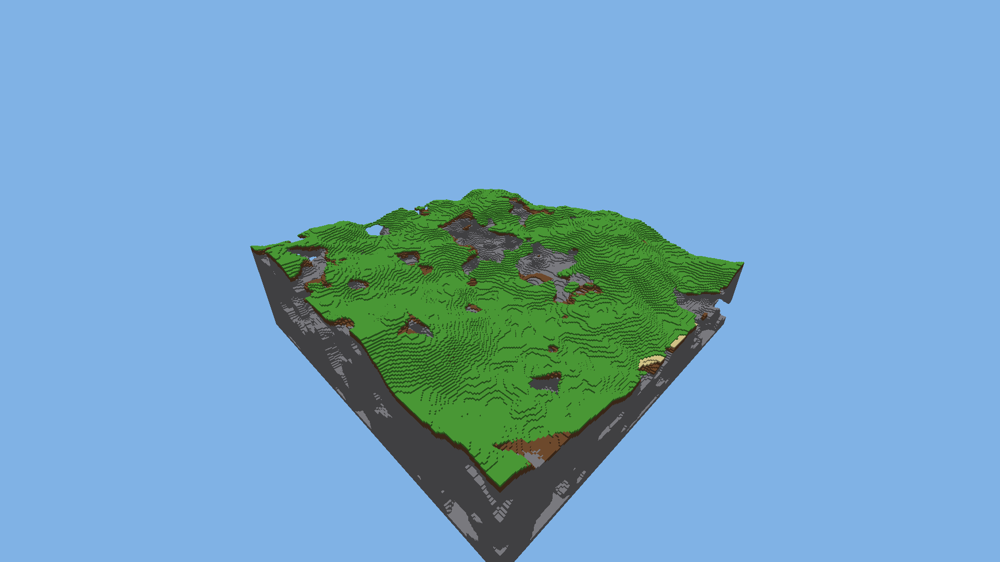
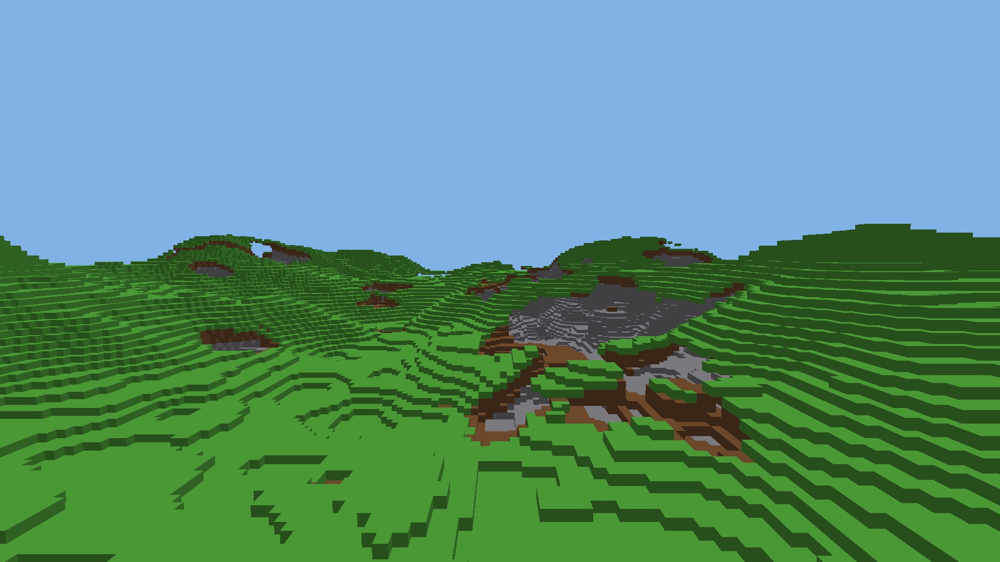

# Spike: GPU terrain meshing through Metal

A standalone Rust crate (not a member of the repo workspace) that tests the
terrain plan in `docs/metal-design.md` ("Frames", "Terrain", "The first
milestone"). A compute shader meshes 16×16×16 sections into packed 8-byte faces
held in allocator-managed slots of one large buffer. A compute pass culls the
sections against the frustum. One draw call then draws every visible face. It
renders offscreen with no window, and full opaque cubes are coloured by block
type.

The spike measured two ways to get from "these sections are visible" to one
draw call. The design doc names an `MTLIndirectCommandBuffer` (ICB). An
alternative, a **chunk list with one instanced indirect draw**, came out about
1.8× faster on the GPU and uses about 80× less memory per draw record. See
[Recommendations](#recommendations).




Machine: Apple M1 Max (10-core CPU, 32-core GPU, 64 GB), macOS 26.3 (25D125),
Rust 1.97.1 (the repo's `rust-toolchain.toml`), objc2 0.6.4,
objc2-foundation 0.3.2, objc2-metal 0.3.2.

## How to run

```sh
cd spikes/metal-meshing
cargo test --release                  # 11 tests; the Metal ones need a GPU
MTL_DEBUG_LAYER=1 MTL_DEBUG_LAYER_ERROR_MODE=assert cargo test --release
MTL_DEBUG_LAYER=1 MTL_DEBUG_LAYER_ERROR_MODE=assert MTL_SHADER_VALIDATION=1 cargo test --release
cargo run --release                   # every measurement below (about 20 s)
SPIKE_IMAGES=/some/dir cargo run --release   # also saves each camera's frame as BMP
cargo clippy --all-targets -- -D warnings
```

## What is in it

| File | What |
|---|---|
| `shaders/common.metal` | Structs shared by every shader, constants, the face packer. Prepended to each file before `newLibraryWithSource` (a runtime-compiled library has no include path). |
| `shaders/mesh.metal` | `mesh_sections` (plain), `mesh_sections_greedy`, and `release_retired` (the allocator's free). |
| `shaders/cull.metal` | `cull_sections` (writes ICB draws) and `cull_chunks` (writes the chunk list). |
| `shaders/draw.metal` | Vertex-pulling vertex shaders for both paths, 6-vertex list and 4-vertex indexed; a flat-colour fragment shader. |
| `src/gpu_types.rs` | `#[repr(C)]` twins of the MSL structs, with sizes asserted at compile time. |
| `src/face.rs` | Face packing and unpacking in Rust. |
| `src/world.rs` | Section-major block storage, block types, cull classes and the rule table, and the deterministic noise terrain. |
| `src/cpu_mesh.rs` | The CPU reference mesher, plain and greedy. |
| `src/mesher.rs` | The GPU mesher: resident buffers, the allocator, readback. |
| `src/render.rs` | Cull and draw for both paths, the per-frame uniform ring, pixel readback. |
| `src/timing.rs` | Stage-boundary GPU timestamps (`MTLCounterSampleBuffer`). |
| `src/main.rs` | The benchmark. |
| `tests/meshing.rs` | The correctness tests. |

## Data layout

**Blocks.** Each block is a `u16` block state. Storage is section-major:
section `s` owns `blocks[s*4096 .. (s+1)*4096]`. Within a section the index is
`x + 16*(z + 16*y)`, Minecraft's order. The test world is
256 × 128 × 256 = 2048 sections. At 16 MB it is twice the 8 MB the design doc
assumes, because the doc's figure is one byte per block. Real block states need
15 bits (about 27k states), so the resident block buffer is 2 bytes per block,
or else a palette per section.

**`SectionInfo`** (48 B, written by the CPU when the world is laid out): the
section's origin, and the index of its neighbour in each of the 6 directions
(`NONE` means air).

**`SectionMesh`** (32 B, written by the GPU mesher, read by the cull pass):
`offset` and `capacity` of the section's slot in the face buffer, plus a face
count per direction. Faces are stored direction-major inside the slot (all
−X, then +X, …), so the cull pass can draw or skip each direction on its own.

## The face format (8 bytes)

```text
word 0  bits  0-3   x in section
        bits  4-7   y in section
        bits  8-11  z in section
        bits 12-14  direction: 0 -X, 1 +X, 2 -Y, 3 +Y, 4 -Z, 5 +Z
        bits 15-18  width - 1   (along the face's u axis; greedy faces only)
        bits 19-22  height - 1  (along the face's v axis; greedy faces only)
        bits 23-31  reserved, 0 (room for AO / light)
word 1  bits  0-15  block state
        bits 16-31  model quad index (0 = the cube face in `direction`)
```

A positive-direction face sits on the far side of its block. The tangent axes
`(u, v)` per direction are `DIR_U = [z, y, x, z, y, x]` and
`DIR_V = [y, z, z, x, x, y]`, chosen so that `cross(u, v)` is the outward
normal. The two triangles `(0,0)(1,0)(0,1)` and `(0,1)(1,0)(1,1)` are therefore
counter-clockwise seen from outside. The render pipeline uses
`frontFacingWinding = CounterClockwise` with back-face culling, and the pixel
tests confirm the winding.

The face does not carry its section. On the ICB path the section index is the
draw's `baseInstance` (Metal's `[[instance_id]]` includes the base instance).
On the chunk path it is in the chunk entry. A design that draws the whole face
buffer in a single non-indirect draw would need the section index inside the
face, which does not fit in 8 bytes alongside everything else.

## The mesher

There is one threadgroup (256 threads) per section, all in **one dispatch with
no separate count pass**:

1. The threadgroup loads its 16³ blocks, plus the one-block border from its six
   neighbour sections, into an 18³ `ushort` tile in threadgroup memory
   (11.4 KB). All later reads come from the tile. Edge and corner cells are not
   loaded, since only the 6-neighbourhood matters here. AO would need them.
2. Each thread owns one x-column of 16 blocks and counts its visible faces per
   direction. It reserves its range with a threadgroup `atomic_uint` per
   direction. This is the "atomic counter per section".
3. After a barrier, thread 0 holds the section's exact count per direction. It
   allocates the section's slot (below) and publishes it through threadgroup
   memory.
4. Each thread recomputes its faces from the tile and writes them to its
   reserved range.

The count and the write happen in the same dispatch, and the allocation is
exact, so the "count pass, then allocate/write pass" design is unnecessary.
Face order within a section depends on thread timing (the order in which
atomics are reserved). So "a stored mesh can be read back and asserted
exactly" (design doc, "Terrain") has to mean **per-section sorted multisets**,
not byte-equal buffers. The tests compare them that way.

**Visible-face rules.** They come from a table, but a table per **cull class**,
not per pair of block states. A state-pair table would have 27k² entries.
`state_class[state] -> class` is 64 KB and `hides[class]` is a 32-bit mask of
the neighbour classes that hide this class's face. The standard rules: opaque
hides every face; glass hides glass; leaves hide nothing. With those rules, a
full section of leaves has **24,576 faces (4096 × 6)**, not the 12,288 of a
checkerboard, and that is the true worst case a slot must be sized for.

**Greedy variant** (`mesh_sections_greedy`): thread `t < 96` owns one slice
(direction `t/16`, layer `t%16`). It sweeps the slice's 16×16 faces in `(v, u)`
order, merges runs with the same block state into rectangles, and tracks what
it has covered in a 256-bit mask held in registers. It sweeps twice, once to
count and once to write. The CPU reference uses the same sweep, so the
rectangles match exactly, not just the covered area.

## The slot allocator

All of it runs on the GPU, in `allocate()` inside the mesh kernel, so the CPU
never reads back a count. There are three modes (`MeshParams.alloc_mode`):

| Mode | Design | Cost on the test world |
|---|---|---|
| `Exact` | Atomic bump pointer, exact size. | 3.51 MB for 3.51 MB of faces after a full mesh. Every remesh leaks its old range until a compaction. |
| `Classes` | Power-of-two size classes from 64 faces, one GPU free stack per class (pop with a compare-exchange loop), bump pointer as fallback. | 5.06 MB for 3.51 MB (**44% overhead**). |
| `Worst` | A fixed 24,576-face slot per section. No allocator at all. | **384 MB** (2048 × 196 KB). Not viable. |

The distribution for sizing fixed slots: 1044 of 2048 sections are non-empty.
Faces per non-empty section: mean 440, p50 410, p90 798, p99 1113, max 1310.
A fixed slot at p99 would cost 17.4 MB and still overflow 1% of sections, so
fixed slots are only an option with an overflow path, and at that point they
are an allocator anyway.

**Remesh and freeing.** A remeshed section always gets a **fresh** slot. Its
old slot goes onto a GPU "retired" list, and the `release_retired` kernel,
dispatched at the start of the next mesh encode, pushes it onto its class's
free stack. Nothing is rewritten in place. This is safe with no CPU tracking of
frames in flight, because every step runs on the same queue. A frame that draws
the old slot is encoded before the dispatch that frees it, and Metal's hazard
tracking orders them. The GPU-side allocator therefore never produces the
"write to a range a frame in flight reads" hazard. See the recommendations for
the CPU-side writes that still do.

A full remesh temporarily doubles the high-water mark: after repeated full
remeshes it settles at 10.1 MB, 2× live, because every old slot is retired
before any is released. Incremental remeshes of a few sections per frame cost
almost nothing extra. The test `remeshing_changed_sections_stays_correct_and_reuses_slots`
runs 40 rounds of random edits (air, stone, glass and leaves, on and across
section borders, remeshing only the touched sections) and checks two things:
the whole world matches the CPU reference after every round, and in `Classes`
mode the bump pointer stays below 1.5× its first value.

**Overflow.** A section that does not fit gets `offset = NONE` and draws
nothing. `AllocState.overflow` counts such sections, and `bump` records how
much was asked for, so the CPU can read both one frame later, grow the buffer
and remesh. The test `overflow_is_reported_and_writes_nothing_out_of_bounds`
covers this. The spike records only the count of overflowed sections. The real
implementation needs a GPU-appended list of them.

## Culling and the draw

The cull pass runs one thread per section. It extracts the frustum planes from
`view_proj` on the GPU (Gribb–Hartmann), tests the section's AABB, and
optionally applies **direction culling**: a section's +X faces are skipped
when `camera.x <= section.min.x`, and so on for each direction, which is
conservative. Two output paths:

**ICB path** (`cull_sections`). There is one `render_command` per
(section, direction), with the pipeline and buffers inherited from the
encoder. `compact = 0` gives every pair a fixed command index: culled pairs get
`reset()`, and the render pass executes all `6 × sections` commands.
`compact = 1` has a visible pair take the next command from an atomic counter,
which is also the `length` of an `MTLIndirectCommandBufferExecutionRange` that
the render pass reads through
`executeCommandsInBuffer:indirectBuffer:indirectBufferOffset:`.

**Chunk path** (`cull_chunks`). Each visible (section, direction) run is cut
into chunks of 2^k faces. Each chunk becomes an 8-byte entry
(`first face slot`, `section << 7 | count`), and an atomic adds to the
`instanceCount` of one `MTLDrawIndexedPrimitivesIndirectArguments`. The render
pass makes **one** `drawIndexedPrimitives(indirectBuffer:)` call:
instance = chunk, vertex = face within the chunk. The last faces of a partial
chunk collapse to a point. It uses no ICB and no argument buffer.

On both paths the per-frame CPU write is the uniforms (`float4x4 view_proj` +
`float4 camera`, 80 bytes; `camera` could be derived from `view_proj` to make
it 64) and a zeroed count (8 or 20 bytes), written into one slot of a
three-slot ring.

## Measurements

Test world: 256 × 128 × 256 blocks, 2048 sections, 3,298,119 solid blocks
(heightmap and 3D-noise caves), **459,850 faces = 3.51 MB of face storage**
(greedy: 138,684 faces = 1.06 MB).

Apple GPUs clock down within about a millisecond of going idle. Timing one
command buffer, submitted alone and waited on, measures a cold GPU: the first
version of this benchmark reported 0.69 ms for a full mesh and 0.75–0.84 ms for
frames. Every number below was taken under continuous load instead: meshing as
20 repetitions in one command buffer (time / 20), and frames with three in
flight. Times come from `GPUEndTime − GPUStartTime` unless marked as
timestamps. Repeated runs agree within about 3%.

### Meshing (GPU ms)

| | Plain | Greedy |
|---|---|---|
| Full world, 2048 sections, from empty (any alloc mode) | **0.46** | 7.2 |
| Remesh 1 section (the busiest, 1310 faces) | **0.054** | 1.10 |
| Remesh a corner block edit (4 sections) | 0.052 | – |
| Remesh 64 sections | 0.054 | 1.14 |
| Full remesh, steady state (slots recycled) | 0.44 | – |
| `release_retired` alone | 0.003 | – |

Remeshing one section costs about the same as remeshing 64. That 54 µs is the
latency of one threadgroup running alone, not throughput: a full mesh works
out to 0.2 µs per section. A block edit's remesh fits easily inside a frame.
The greedy mesher is 15× slower to mesh (96 of 256 threads active, a serial
sweep per slice). Its 1.1 ms single-section latency is too much to pay in the
frame the edit happens.

### Frames at 1920×1080, GPU ms (cull + draw, one command buffer)

| Camera | Faces in frustum | …after dircull | ICB draws (dircull) | ICB reset | ICB compact | ICB compact + dircull | **Chunks of 16 + dircull** |
|---|---|---|---|---|---|---|---|
| overview, whole world | 459,850 | 229,925 | 2,667 | 0.780 | 0.690 | 0.452 | **0.238** |
| ground level, looking along | 342,078 | 162,196 | 2,106 | 0.721 | 0.568 | 0.384 | **0.168** |
| above centre, 45° down | 316,733 | 143,409 | 1,857 | 0.752 | 0.546 | 0.363 | **0.185** |
| sky (nothing visible) | 0 | 0 | 0 | 0.352 | 0.051 | 0.050 | **0.043** |

All of these use indexed, 4-vertex faces. The benchmark's full table has
16 variants. The findings from it:

- **Resetting culled ICB commands is not free.** Executing 12,288 empty
  (reset) commands costs about 0.30 ms with nothing drawn. Compacting and
  reading the range from a GPU buffer is essential.
- **Direction culling** halves the faces and saves about a third (32–34% on
  the indexed, compacted ICB path).
- **Indexed, 4 vertices per face**, against a 6-vertex list: 8–14% faster on
  the ICB path, and 23–26% faster on the chunk path.
- **The chunk path is 1.8–2.3× faster than the best ICB variant.** Stage
  timestamps show where the time goes. On the ICB path, vertex work takes
  0.33–0.47 ms. On the chunk path it takes 0.16–0.21 ms. Fragment work is the
  same on both (0.10–0.16 ms), and so is the cull (0.007–0.019 ms).
- **Chunk size matters, and not smoothly** (overview camera, indexed):
  4 → 0.249, 8 → 0.247, 16 → 0.247, **32 → 0.737**, 64 → 0.397 ms. The 6-vertex
  list path does not show the cliff (0.33–0.39 ms). Indexed instances stay fast
  at up to 64 unique vertices (16 faces). This looks like a hardware
  vertex-batch limit, but that explanation is inferred, not documented.
  Padding waste at 16: 15,656 instances × 16 = 250k face slots for 230k faces.
- **Greedy faces**, same frames: ICB 0.45 → 0.38 ms; chunks 0.25 → 0.12 ms
  (overview). With chunks, greedy halves the frame, because the frame is bound
  by vertex work.

### CPU per frame, against world size

This is the uniform write, the cull encoder, the render pass and the single
draw call, measured from command-buffer creation to just before `commit`:

| World | Sections | ICB: CPU / GPU | Chunks: CPU / GPU |
|---|---|---|---|
| 64×128×64 | 128 | 11.3 µs / 0.095 ms | 10.1 µs / 0.071 ms |
| 256×128×256 | 2048 | 11.0 µs / 0.456 ms | 10.0 µs / 0.249 ms |
| 512×128×512 | 8192 | 11.3 µs / 1.252 ms | 10.1 µs / 0.748 ms |

The CPU cost is flat, as the design requires. GPU cost grows with what is in
view, which is expected.

### Memory

| | Test world (2048 sections) | Render distance 32 (≈101k sections) |
|---|---|---|
| Blocks (u16) | 16 MB | ≈ 800 MB, so a palette per section is needed |
| Faces (plain / greedy) | 3.5 / 1.1 MB | scales with the terrain |
| Face slots, `Classes` | 5.1 MB | +44% |
| **ICB**, 6 commands per section | **8.3 MB** (673 B per command) | **≈ 410 MB** |
| Chunk list, sized for the worst case (4 faces per chunk) | 16.1 MB (8 B per entry) | tens of MB |

ICB memory is the same whatever the options: 656–688 bytes per command for
Draw, DrawIndexed, both, inherited buffers or not, measured with
`allocatedSize`.

## Tests

`cargo test --release`: **11 passed** (1 unit, 10 integration). The Metal tests
panic on a machine with no Metal device, so they fail there instead of
skipping.

- `tiny_worlds_have_exact_face_counts`: empty = 0; a single block = 6;
  two adjacent = 10; an L of three = 14; a full section = 6×256; two full
  sections stacked = 2×1536 − 2×256 (neighbour border reads); two blocks
  touching across a section boundary = 10. Every count also equals the CPU
  reference.
- `the_rule_table_decides_visibility`: glass|glass = 10, stone|glass = 11,
  leaves|leaves = 12, stone|leaves = 11.
- `worst_case_sections`: checkerboard = 12,288, full leaves = 24,576.
- `big_world_gpu_equals_cpu_in_every_alloc_mode`: on the 256×128×256 world,
  the GPU face multiset per section equals the CPU reference in `Exact`,
  `Classes` and `Worst`.
- `greedy_matches_cpu_and_covers_the_same_faces`: greedy GPU equals greedy CPU
  exactly, and each section's rectangles expanded to unit faces equal the plain
  mesh. A solid section gives 6 faces of 16×16.
- `remeshing_changed_sections_stays_correct_and_reuses_slots`: described above.
- `overflow_is_reported_and_writes_nothing_out_of_bounds`: described above.
- `rendered_pixels`: a 64×64 render of three blocks, through all 16 draw paths
  (ICB list/indexed × dircull × reset/compact, and chunks of 16 and 64 ×
  list/indexed × dircull). It checks four things. The centre pixel is the front
  block's shaded +Z colour, so the depth test works (a block behind it loses).
  A corner is the clear colour. A block off to the side shows. From above, the
  centre is the top face's colour. From outside the section looking away,
  nothing is drawn and the compacted draw count is 0.
- `culling_counts_visible_draws`: seen whole from above, the GPU draw count
  equals the non-empty (section, direction) pairs. With direction culling it
  equals a CPU recount under the same rule, and chunk instances equal
  `Σ ceil(count / 32)`.
- `large_indirect_ranges_draw_the_same_image`: a 512×128×512 world seen whole
  gives more than 16,384 ICB draws. The GPU-written range, the fixed range with
  resets, and chunks of 16 and 64 all produce byte-identical images.

**Validation layer.** `MTL_DEBUG_LAYER=1 MTL_DEBUG_LAYER_ERROR_MODE=assert`:
all 11 tests pass and nothing fires. Adding `MTL_SHADER_VALIDATION=1` (GPU
bounds checks and friends): all pass, nothing fires.
`MTL_DEBUG_LAYER_WARNING_MODE=assert` aborts on a **false positive**: every
render encoder that executes an ICB with `inheritBuffers = YES` warns
`unused binding in encoder at Buffer index 0..3`. The layer does not count
bindings used by inherited ICB draws. The chunk path produces no warnings.

**What the validation layer does and does not catch.** Each mistake was made on
purpose, then undone:

| Mistake | Without the debug layer | With it (assert) |
|---|---|---|
| Render pipeline without `supportIndirectCommandBuffers` | GPU **page fault**: `kIOGPUCommandBufferCallbackErrorPageFault` | caught: "the render pipeline set on this encoder does not support indirect command buffers" |
| No `useResource(icb, write)` on the cull encoder | renders correctly | **not caught** (shader validation too) |
| No `useResource(indexBuffer, read)` for an index buffer named only inside ICB commands | renders correctly | **not caught** (shader validation too) |

On Apple silicon, shared buffers are resident anyway, so a missing
`useResource` works by accident today. Nothing checks it.

## Findings and surprises

1. **One dispatch does count, allocate and write.** Holding the tile in
   threadgroup memory makes a separate count pass and a prefix sum over
   sections unnecessary.
2. **The worst case is 24,576 faces (leaves against leaves), not 12,288.**
   Worst-case slots cost 384 MB for a 256² world.
3. **Size classes are simple and cost 44%.** A finer scheme (4 classes per
   power of two, or TLSF) would bring that to roughly 10–20%. There is no
   coalescing, so free 64-face blocks cannot serve a 128-face request. A long
   session needs compaction, or it slowly consumes the bump region.
4. **A GPU-resident allocator is safe against frames in flight with no CPU
   bookkeeping**, because it lives in queue order. The in-flight hazard remains
   only for CPU writes: block uploads and the job list.
5. **Face order is nondeterministic** within a section. Exact assertions must
   compare sorted multisets per section.
6. **ICB costs:** 673 B per command whatever the options; about 0.3 ms to
   execute 12k reset commands; slower vertex processing than one instanced
   draw.
7. **The chunk list plus one indirect instanced draw beats the ICB** by
   1.8–2.3× GPU time and about 80× memory per draw record, and needs none of
   the ICB ceremony (argument buffer, `useResource`,
   `supportIndirectCommandBuffers`).
8. **Indexed instanced draws have a cliff above 16 faces (64 vertices) per
   instance** on the M1 Max.
9. **Section-level culling cannot cull the section the camera is in.** The
   first draft of the pixel test "looking away" failed because of this.
10. **GPU clock scaling** doubles single-submit timings. Benchmarks must keep
    the GPU busy, and the design doc's ratcheted GPU timings will need the same
    discipline (batching, or frames in flight).
11. **Stage-boundary timestamps work on the M1 Max**
    (`MTLCounterSamplingPointAtStageBoundary`, timestamp counter set). The GPU
    tick is not documented as nanoseconds; the spike calibrates it with
    `sampleTimestamps:gpuTimestamp:` against the wall clock.
12. **Vertex work dominates** at 1080p with flat colours: vertex 0.16–0.47 ms
    against fragment 0.10–0.16 ms. The overview draws every face underneath
    too (cave walls), because nothing does occlusion culling.

### objc2-metal 0.3.2

objc2-metal 0.3.2 **did not block anything**: every Metal call the spike needed
is bound. Some rough edges:

- Many methods are `unsafe` with "might not be bounds-checked" (`setBuffer`,
  `setBytes`, `executeCommandsInBuffer`, `newArgumentEncoderWithBufferIndex`,
  `objectAtIndexedSubscript`, `setSampleCount`, …). `scarlet_metal` will carry
  one `SAFETY:` line per call, as `docs/metal-design.md` already requires.
- `MTLIndirectCommandBufferExecutionRangeMake` is a `TODO` in the bindings.
  The struct itself is bound, so this is harmless.
- `sampleTimestamps_gpuTimestamp` takes `NonNull<u64>`, not `&mut u64`.
- `MTLCommonCounterSetTimestamp` is an `extern static`, so reading it is
  `unsafe`. Finding the counter set means comparing names.
- `allocatedSize` is ambiguous between the `MTLAllocation` and `MTLResource`
  traits when both are in scope. It needs `MTLResource::allocatedSize(&*x)`.
- `ProtocolObject::from_ref(&*icb)` converts an ICB or buffer to
  `&ProtocolObject<dyn MTLResource>` for `useResource`, as expected.

## Recommendations

### For the design doc

- **Replace "writes the draws that survive into an indirect command buffer"
  with a chunk list and one indirect instanced draw**, unless a later need
  (per-draw state changes) forces an ICB. Keep 16 faces per instance, indexed,
  with the cliff above recorded. `Draw::Indirect(commands, range_start,
  range_count)` in "Frames" then becomes, roughly,
  `DrawIndirect(pipeline, bindings, index Option(IndexBuffer), args Buffer, offset Int)`.
  If the ICB stays, its range must be allowed to come from a GPU buffer
  (`executeCommandsInBuffer:indirectBuffer:`), since the fixed range with
  resets costs 0.3 ms per 12k commands, and its memory (673 B per command) must
  be budgeted.
- **"Scarlet's frame … write about 64 bytes"** is borne out: 80 bytes of
  uniforms (64 if the camera position is derived) plus zeroing a 20-byte draw
  argument. The measured CPU time per frame is about 10 µs, flat from 128 to
  8192 sections.
- **Block storage is 2 bytes per block** (or a palette per section, which is
  already an open question), not 1: 16 MB for the milestone world.
- **The rule table is per cull class**, with a state → class map, not per pair
  of block states.
- **The allocator**: GPU-resident, with power-of-two classes as the first cut,
  fresh slots on remesh, and deferred release by queue order. Budget for 2×
  during a full remesh. The overflow path is a GPU-appended list of overflowed
  sections plus a grow-and-copy.
- **Keep plain meshing for the milestone.** Greedy halves the frame on the
  chunk path but costs 1.1 ms of GPU latency per remesh as written. A faster
  parallel greedy mesher is a later measurement.
- **"Asserted exactly"** means per-section sorted multisets.
- **GPU timings for the ratchet** must be taken under load (batched or
  pipelined). Cold numbers are 1.5–2× worse and noisy.
- **CPU writes into resident buffers** (block uploads, remesh job lists) are
  where `Err(InFlight)` can actually happen. Routing them through the
  per-frame ring as staging, with a GPU copy into the resident buffer, keeps
  them ordered on the queue like everything else, so `InFlight` becomes rare.

### What `scarlet/metal` must expose

- **Compute pipelines** from a library compiled at run time, looked up by
  function name.
- **`dispatchThreadgroups` with an explicit threadgroup size**, counted in
  threadgroups, not threads. The mesher depends on exactly one threadgroup per
  section. Threadgroup memory and atomics live in the shader and need no API.
- **Buffer bindings at an offset** (ring slots, a section's range) and small
  inline bytes (`setBytes`) for per-dispatch parameters.
- **An indirect draw**: `drawIndexedPrimitives(indirectBuffer:)` and
  `drawPrimitives(indirectBuffer:)`, with the argument buffer and offset.
  Instanced draws with `[[instance_id]]`.
- **A `u16` index buffer**, created once.
- **Depth**: a `Depth32Float` texture, a depth-stencil state (`Less`, write
  on), clear depth, `DontCare` store.
- **Rasteriser state**: cull mode and front-facing winding.
- **Blit fill and copy**, for GPU resets, grow-and-copy, and staging copies.
- **Frame statistics** later: `GPUStartTime`/`GPUEndTime` are enough to begin
  with; stage-boundary counters are cheap to add.
- **If the ICB is kept:** an `IndirectCommands` handle that is directly
  bindable to a dispatch. The runtime should build the argument buffer and emit
  `useResource` itself, because the validation layer does not check it. It
  should also force `supportIndirectCommandBuffers` on every render pipeline
  that can meet an ICB, or check it before encoding, because without the debug
  layer the mistake is a GPU page fault, not an error. Either can be a
  type-level property of the pipeline value.

## Risks

- **Scale.** At render distance 32 there are about 101k sections. A cull pass
  of one thread per section is fine, but the ICB would be about 410 MB. The
  chunk list scales with visible faces.
- **Vertex-bound.** About 0.9 µs per 1,000 faces on the chunk path
  (230k faces in 0.21 ms of vertex time). Millions of faces at long render
  distances need greedy meshing, level of detail, or occlusion culling
  (Hi-Z), none of which is measured here.
- **Allocator fragmentation.** No coalescing and no compaction yet.
- **The overflow path** is only counted, not recovered.
- **Validation blind spots:** missing `useResource` is not caught, and the ICB
  warnings are false positives, so `WARNING_MODE=assert` cannot be used
  alongside ICBs.
- **One machine.** The chunk-size cliff and the ICB costs were measured only
  on an M1 Max. Other Apple GPU families may differ, and CI has no Metal
  device.
- **Face order is nondeterministic**, which rules out byte-exact golden
  buffers.
